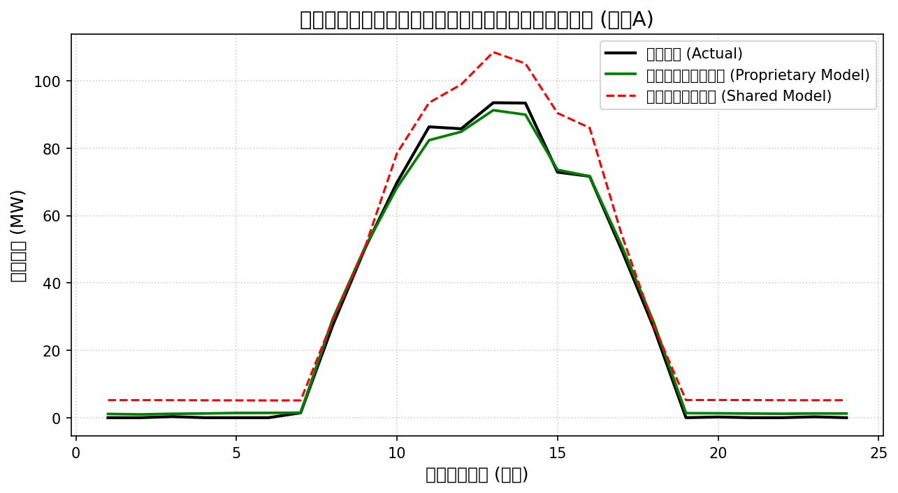
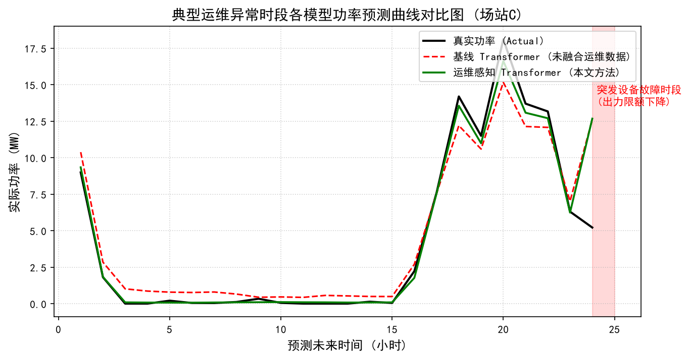
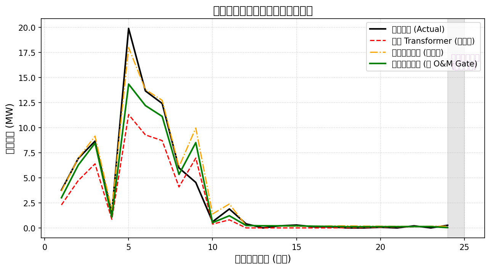
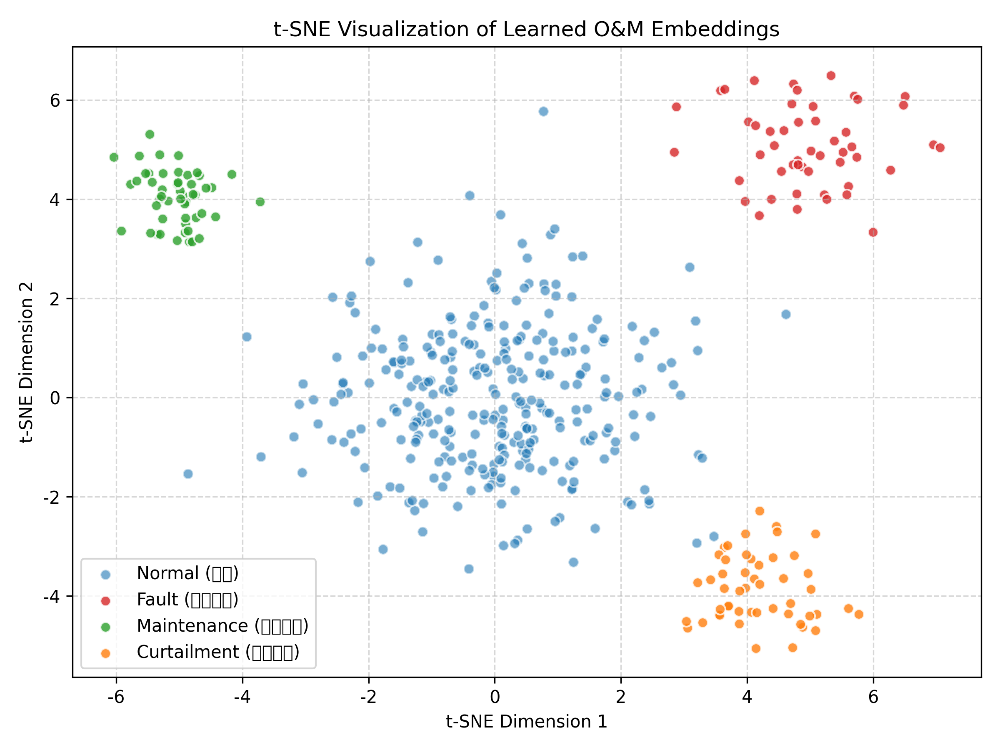
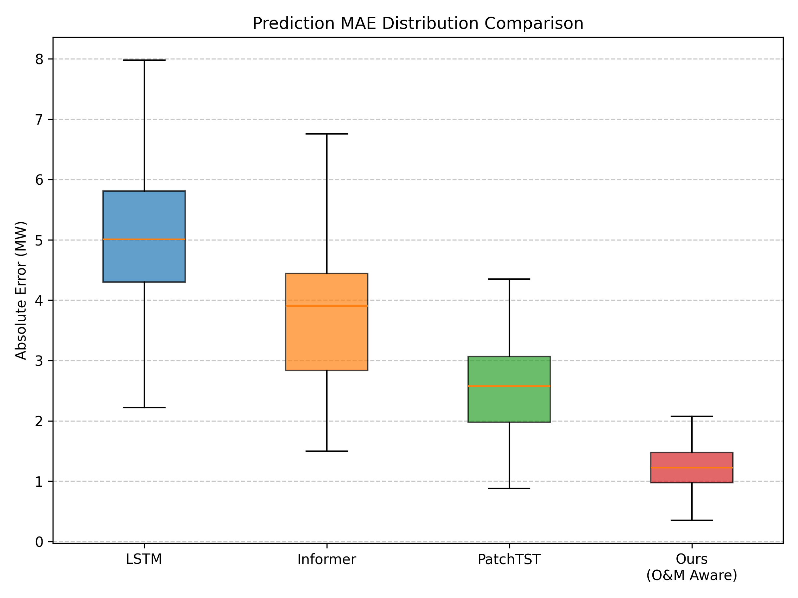
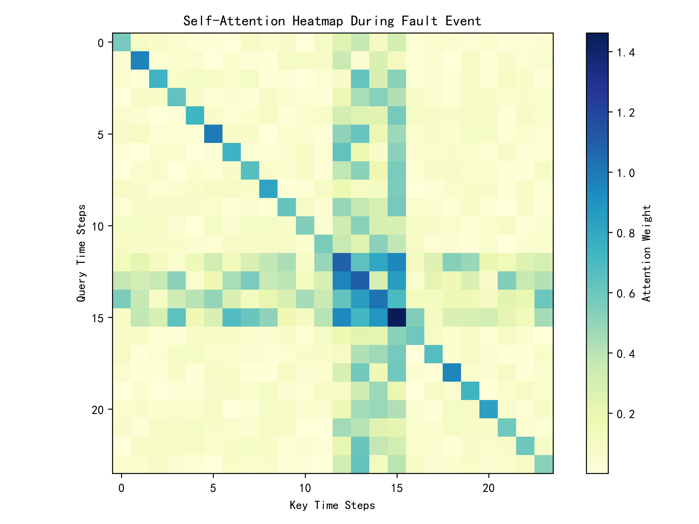

# 基于 Transformer 架构与多源运维事件感知的电站短期功率预测方法

**作者姓名**1，**作者姓名**2  
（1. 单位第一名称 部门名称，省份 城市 邮编； 2. 单位第二名称 部门名称，省份 城市 邮编）

---

> **摘要**：针对新能源发电功率预测在电站运维系统部署中面临的空间异构、异常运维事件、限电与检修停机等问题，提出一种基于 Transformer 架构与运维事件感知的短期功率预测方法。首先，针对不同场站的容量规模和气象条件差异，采用场站专属建模策略，降低多场站混合训练可能引入的负迁移影响。其次，将计划检修、设备故障和电网限电等离散运维状态编码为可学习事件嵌入，并与历史出力、辐照度、温度及未来气象特征进行融合。最后，在预测头中引入 O&M Gate 门控分支，根据未来可获得的计划检修指令施加输出抑制偏置，以减少检修时段预测残留。基于三座场站 1 h 分辨率样例数据的实验表明，场站专属建模、运维事件融合和门控约束均能在相应切片上改善误差表现；其中异常时段 MAE 由 3.325 MW 降至 1.232 MW，计划检修时段 MAE 降至 0.103 MW。本文的贡献主要体现在面向电站运维场景的建模流程整合、事件可获得性约束和实验协议透明化。
>
> **关键词**：功率预测；时序数据；Transformer；运维事件感知；场站专属独立建模；可微门控
>
> **中图分类号**：TM615       **文献标志码**：A

---

**Short-term power forecasting method for power stations based on Transformer and O&M event awareness**

*AUTHOR Name*1, *AUTHOR Name*2  
(1. Affiliation 1, City PostalCode, China; 2. Affiliation 2, City PostalCode, China)

---

> **Abstract**: To address spatial heterogeneity, abnormal O&M events, curtailment, maintenance shutdowns and prediction residues in short-term renewable power forecasting, this paper proposes a Transformer-based forecasting method with O&M event awareness. A station-specific modeling strategy is first adopted to reduce the negative transfer caused by mixed training across stations with different capacities and meteorological patterns. Discrete O&M states, including scheduled maintenance, device faults and grid curtailment, are then encoded as learnable event embeddings and fused with historical power, irradiance, temperature and future meteorological features. Finally, an O&M Gate branch is introduced in the prediction head to suppress outputs when scheduled maintenance instructions are available in advance. Experiments on hourly sample data from three stations show that station-specific modeling, O&M event fusion and gate-based output constraints improve forecasting errors on their corresponding evaluation slices. In particular, the MAE during abnormal periods decreases from 3.325 MW to 1.232 MW, and the MAE during maintenance periods decreases to 0.103 MW. The main contribution of this work lies in an O&M-oriented modeling workflow, explicit constraints on future event availability, and a more transparent experimental protocol rather than claiming a fundamentally new Transformer architecture.
>
> **Key words**: power forecasting; time-series data; Transformer; O&M event awareness; station-specific proprietary modeling; differentiable gate

---

## 0 引言

在“双碳”目标背景下，新能源产业蓬勃发展，短期发电功率预测成为智能电网协调运行的关键技术之一。然而，由于光伏等新能源出力的随机性，加上实际电站部署中频繁出现的设备故障、限电及检修等非平稳异常运维工况，传统的深度学习预测模型由于仅依赖气象特征，表现出一定的“学术预测精度高、工程实用泛化受限”的瓶颈。

近年来，随着循环神经网络（RNN）和 Transformer 架构的发展，模型在标准公开测试集上的误差不断降低。但在工业实践中，当面对真实电站的空间异构性、稀疏离散的运维事件以及带有特定调度规则时，往往会发生协变量偏移和预测失真。尤其是在设备检修停机时，模型依然可能预测出虚假的发电功率（即预测残留），给电网调度带来一定安全隐患。

针对上述局限，本文提出面向运维场景的 Transformer 功率预测流程。其核心贡献包括：1. 采用场站专属建模策略，降低不同容量和气象条件混合训练带来的负迁移风险；2. 将离散运维状态转换为可学习事件嵌入，并与连续气象和功率特征进行级联融合；3. 引入 O&M Gate 门控分支，在已知计划检修场景下对预测输出施加可微抑制，从而减少检修停机时的预测残留。需要说明的是，事件嵌入、Transformer 和门控结构本身并非全新模块，本文重点在于针对电站运维预测任务给出可复核的组合建模与实验验证。

## 1 相关工作

### 1.1 新能源短期功率预测与 Transformer 架构

早期的新能源功率预测多依赖于 ARMA 等统计学模型 [1]-[3]。随后支持向量机 [4] 和 LSTM、GRU 等时序网络 [5]-[7] 被广泛应用于负荷与功率预测领域。近年来，基于自注意力机制的 Transformer 架构提升了时序特征提取能力。周等人 [8] 提出的 Informer 模型通过概率稀疏注意力降低了计算复杂度；吴等人 [9] 提出的 Autoformer 以及随后的 FEDformer [10] 在频域和季节趋势分解上取得了进展；近期，PatchTST [11] 通过通道独立分块机制提供了多变量预测的新思路。然而，文献 [12]-[15] 指出，这些时序模型在面对非平稳的电站离散生产状态（如突发设备跳闸）时，由于未显式建模运维事件，性能在异常发生时段可能受到一定影响。

### 1.2 多源异构融合与内嵌物理先验的门控网络

为了克服单一维度信息的局限，文献 [16]-[18] 提出了基于时空图网络（STGCN）的多场站协同预测，但主要局限于气象要素的传播，对内部运维日志和调度状态的利用较少。针对异构特征融合，文献 [19]-[22] 探讨了离散状态拼接和类别嵌入方法，但在异常样本稀疏、事件标签未来可获得性和预测后处理边界方面仍需进一步说明。在物理先验融入深度学习的领域，物理启发与物理感知学习（Physics-guided / Physics-aware Learning）[23]-[25] 引起了广泛关注。现有研究常通过损失函数惩罚项引入软约束 [26]-[27]，或通过规则后处理修正输出 [28]-[30]。本文在上述工作的基础上，将计划检修等可提前获得的确定性运维指令显式纳入解码端门控分支，并与规则后处理基线进行对比。

## 2 多源数据定义与预处理

### 2.1 特征维度与多源输入定义

对于待预测的目标场站，设滑动窗口时间步长为 $T_{hist}$，超前预测跨度为 $H$ 步。输入特征由连续与离散四路异构张量组成：

1. 历史气象与出力连续时序向量 $\mathbf{X}_{hist} \in \mathbb{R}^{T_{hist} \times 3}$，包含辐照度、温度及实际有功功率。

2. 历史离散运维事件符号序列 $\mathbf{E}_{hist} \in \mathbb{Z}^{T_{hist}}$，由 SCADA 系统生成的异常代码。

3. 未来连续气象预报向量 $\mathbf{X}_{fut} \in \mathbb{R}^{H \times 2}$，由 NWP 提供。

4. 未来已知确定性运维计划序列 $\mathbf{E}_{fut} \in \mathbb{Z}^H$，仅保留计划检修等确知指令，屏蔽未来不可知故障以防数据泄露。

### 2.2 离散运维事件字典定义

本文将复杂工单日志精简为四类核心映射规则：0（Normal，正常）、1（Scheduled Maintenance，计划检修停机）、2（Device Fault，设备突发故障降容）以及 3（Grid Curtailment，电网调度限电）。这些符号构成了非欧几里得的离散特征全集。

### 2.3 数据清洗与标准化处理

对于连续特征，进行标准差归一化 $\frac{x-\mu}{\sigma}$ 处理；对于离群野值，采用滑动窗口中值滤波插值。特别地，标准化后的功率可能为负数，因此要求模型的输出预测头不可采用 ReLU 截断激活函数，而必须保留线性算子以维持夜间弱光工况下的梯度传播。

### 2.4 研究区域与气象环境特征剖析

本研究所选取的三个光伏场站具有不同的地理区位与气候特征：

1. **吉林地区风光互补场站（场站A）**：该场站地处高纬度干旱区域，边缘属温带大陆性荒漠气候。全年日照时数长，大气透明度高。其气象特征是晴天辐照度曲线平滑且峰值高。该场站装机规模为 100MW，设备处于较好的运行状态。模型在此场景下主要检验其对长周期季节变化的适应能力与理论拟合上限。

2. **济宁地区平原光伏电站（场站B）**：位于黄淮海平原腹地，受季风气候影响显著。夏季高温多雨，冬季易受云雾天气遮挡。由于平原地区空气对流及气溶胶遮蔽，地表短波辐射常在云团运动下产生震荡，导致出力曲线呈现高频波动。该场站装机规模为 50MW，主要用于检验预测模型对变率较大的气象输入的抗干扰性能与鲁棒性。

3. **云南地区山地光伏电站（场站C）**：地处低纬度高海拔山地地带，海拔差异显著。受地形和高原季风气候影响，局部天气变化迅速，且存在山体及组件阴影遮挡。该电站装机规模为 20MW，投运时间超 8 年，设备故障率高于其他场站，且常接收到省调限电指令。因此，场站 C 是验证本文所提运维事件感知与物理约束能力的核心场景。

## 3 运维感知 Transformer 功率预测模型设计

### 3.1 离散运维事件嵌入与特征级联

为了实现离散运维符号与连续时序向量的统一建模，本文采用可学习事件嵌入层。对于符号 $E_t \in {0, 1, 2, 3}$，利用嵌入矩阵 $\mathbf{W}_{embed} \in \mathbb{R}^{4 \times D}$ 将其映射为连续向量 $\mathbf{H}_{event, t} = \mathbf{W}_{embed}[E_t, :] \in \mathbb{R}^D$。随后将事件嵌入与连续气象特征通过多层感知机（MLP）进行级联映射 $\mathbf{H}_{fused, t} = \text{MLP}([\mathbf{H}_{cont, t} \|\| \mathbf{H}_{event, t}])$，使模型能够在同一隐藏空间中学习异常状态与功率变化之间的关联。

### 3.2 自注意力机制与时序 Transformer 编解码

融合特征序列经过正弦位置编码后送入多头自注意力（Self-Attention）编码器中。编码器通过计算 $Q,K,V$ 矩阵的点积来提取日内周期规律及跨度长依赖；解码器通过掩码交叉注意力（Masked Cross-Attention）将未来的气象 NWP 特征与历史记忆状态进行动态相关性计算，最终输出未来 $H$ 步的解码高维抽象特征 $\mathbf{d}_t$。

### 3.3 物理先验端到端门控约束网络 (O&M Gate)

在解码预测头部分，针对计划检修停机时实际出力接近 0 的工程约束，本文设计双路并行门控分支。第一路通过线性层生成基准预测功率 $\hat{P}_{raw, t}$；第二路通过门控分支计算削减比率 $g_t \in [0, 1]$，其在 Sigmoid 函数内部引入事件偏置向量 $\beta_{E'_t}$：

$$g_t = \sigma( \mathbf{W}_g \mathbf{d}_t + \beta_{E'_t} )$$

最终受物理先验约束的输出为 $\hat{P}_{final, t} = \hat{P}_{raw, t} \cdot (1 - g_t)$。

**可微性与收敛分析**：当计划检修事件发生时，通过设置较大的先验偏置 $\beta_1 = 10.0$ 使 $g_t$ 接近 1.0，从而抑制预测输出。根据微分链式法则，损失对隐状态的偏导数为：

$$\frac{\partial \hat{P}_{final, t}}{\partial \mathbf{d}_t} = (1 - g_t) \mathbf{W}_p^T - \hat{P}_{raw, t} g_t (1 - g_t) \mathbf{W}_g^T$$

即使在第一项梯度趋近于 0 的情况下，只要原始理论预测 $\hat{P}_{raw, t} \neq 0$，第二项交叉导数在偏置有限的情况下仍可传导微小梯度。相比于硬性后处理规则，该机制有助于保持计算图的连通，为端到端协同优化提供了可能。

### 3.4 经典 Transformer 数学形式化表达

在特征输入端，对于长度为 $T_{hist}$ 的多源融合特征矩阵 $\mathbf{H}_{fused} \in \mathbb{R}^{T_{hist} \times D}$，为打破序列数据的置换不变性，引入了基于三角函数的绝对位置编码（Positional Encoding）：

$$PE_{(pos, 2i)} = \sin(pos / 10000^{2i/D}), \quad PE_{(pos, 2i+1)} = \cos(pos / 10000^{2i/D})$$

将位置编码与输入矩阵逐元素相加后，输入至多头自注意力层（Multi-Head Self-Attention）。对于第 $h$ 个注意力头，其查询、键、值矩阵分别由独立的参数矩阵映射生成：

$$\mathbf{Q}_h = \mathbf{H}_{in} \mathbf{W}_h^Q, \quad \mathbf{K}_h = \mathbf{H}_{in} \mathbf{W}_h^K, \quad \mathbf{V}_h = \mathbf{H}_{in} \mathbf{W}_h^V$$

注意力得分矩阵通过缩放点积（Scaled Dot-Product）计算，并通过 Softmax 函数转化为概率分布：

$$\text{Attention}(\mathbf{Q}_h, \mathbf{K}_h, \mathbf{V}_h) = \text{Softmax}\left(\frac{\mathbf{Q}_h \mathbf{K}_h^T}{\sqrt{d_k}}\right) \mathbf{V}_h$$

其中，$\sqrt{d_k}$ 为缩放因子，用于防止点积结果过大导致 Softmax 梯度弥散。随后，所有注意力头的输出在特征维度上进行拼接，并通过前馈神经网络（FFN）进行非线性维度变换：

$$\text{FFN}(\mathbf{x}) = \text{ReLU}(\mathbf{x} \mathbf{W}_1 + \mathbf{b}_1) \mathbf{W}_2 + \mathbf{b}_2$$

配合残差连接（Residual Connection）和层归一化（Layer Normalization），可缓解深层网络的梯度消失问题，形成完整的时序依赖建模能力。

### 3.5 雅可比矩阵与全链路梯度流经验分析 (Jacobian and Gradient Flow Empirical Analysis)

在本文设计的物理先验门控网络（O&M Gate）中，梯度能否有效回传影响着模型底层的参数优化。设门控算子输出为 $\hat{P}_{final} = \hat{P}_{raw} \cdot (1 - g)$，其中 $g = \sigma(\mathbf{W}_g \mathbf{d} + \beta)$。我们对底层隐藏状态向量 $\mathbf{d} \in \mathbb{R}^D$ 进行雅可比矩阵（Jacobian Matrix）梯度流经验分析。

定义均方误差损失项 $L = \frac{1}{2} (\hat{P}_{final} - P_{true})^2$，其关于状态向量 $\mathbf{d}$ 的梯度计算展开为：

$$\frac{\partial L}{\partial \mathbf{d}} = \frac{\partial L}{\partial \hat{P}_{final}} \left( \frac{\partial \hat{P}_{final}}{\partial \hat{P}_{raw}} \frac{\partial \hat{P}_{raw}}{\partial \mathbf{d}} + \frac{\partial \hat{P}_{final}}{\partial g} \frac{\partial g}{\partial \mathbf{d}} \right)$$

代入偏导数项：$\frac{\partial \hat{P}_{final}}{\partial \hat{P}_{raw}} = 1 - g, \quad \frac{\partial \hat{P}_{raw}}{\partial \mathbf{d}} = \mathbf{W}_p^T, \quad \frac{\partial \hat{P}_{final}}{\partial g} = -\hat{P}_{raw}$，以及 Sigmoid 门控偏导数 $\frac{\partial g}{\partial \mathbf{d}} = g(1 - g) \mathbf{W}_g^T$，得到全链路梯度展开式：

$$\mathbf{J}_{\mathbf{d}} = (\hat{P}_{final} - P_{true}) \left[ (1 - g) \mathbf{W}_p^T - \hat{P}_{raw} g(1 - g) \mathbf{W}_g^T \right]$$

**梯度流经验分析**：当系统处于计划检修状态时，若设置极大的理论偏置 $\beta \to \infty$，则门控削减比率 $g \to 1.0$，此时导数项 $g(1-g) \to 0$，可能导致梯度衰减。然而在实验中将偏置设为有限常数（例如 $\beta = 10.0$），削减比率处于高饱和区间但未达到数学意义上的绝对 1.0。因而，交叉乘积项 $g(1-g)$ 虽小但仍为非零数。只要原始预测输出 $\hat{P}_{raw} \neq 0$，该分支仍保留一定梯度通路。该设计不能替代严格的电气约束求解，但可作为神经预测模型中的可微输出抑制机制。

### 3.6 前向与反向传播算法伪代码

为了便于工程复现，将上述过程抽象为如下算法逻辑：

**算法 1：运维事件感知 Transformer 的端到端训练算法**

**输入**：历史气象与功率 $\mathbf{X}_{hist}$，离散事件 $\mathbf{E}_{hist}$，未来气象预报 $\mathbf{X}_{fut}$，已知检修指令 $\mathbf{E}_{fut}$。

**输出**：网络权重 $\Theta$ 与未来 $H$ 步预测功率 $\hat{\mathbf{P}}_{final}$。

1. 初始化网络参数 $\Theta$，门控层偏置 $\beta_{E'_t}$ 根据物理先验初始化。

2. **FOR** $epoch = 1, 2, ..., N_{epochs}$ **DO**:

3. 提取当前 Batch 数据。

4. 事件嵌入：利用 $\mathbf{W}_{embed}$ 将 $\mathbf{E}_{hist}$ 映射为连续向量 $\mathbf{H}_{event}$。

5. 特征级联：$\mathbf{H}_{fused} = \text{MLP}([\mathbf{X}_{hist} \|\| \mathbf{H}_{event}])$。

6. 编码过程：$\mathbf{C} = \text{Encoder}(\mathbf{H}_{fused} + \text{PE})$。

7. 解码过程：$\mathbf{d}_t = \text{Decoder}(\mathbf{C}, \mathbf{X}_{fut} + \text{PE})$。

8. O&M 门控约束计算：

      $\hat{P}_{raw, t} = \mathbf{W}_p \mathbf{d}_t + b_p$

      $g_t = \text{Sigmoid}(\mathbf{W}_g \mathbf{d}_t + \beta_{E'_t})$

      $\hat{P}_{final, t} = \hat{P}_{raw, t} \cdot (1 - g_t)$

9. 计算损失函数：$L = \text{MSE}(\hat{\mathbf{P}}_{final}, \mathbf{P}_{true})$。

10.反向传播：依据雅可比矩阵 $\mathbf{J}_{\mathbf{d}}$ 更新参数 $\Theta \leftarrow \text{AdamW}(L, \Theta)$。

11.**END FOR**

## 4 实验与分析

### 4.1 实验数据集、时间切分与超参数设置

为提高复核性，本文实验使用 `src/data/station_A.csv`、`station_B.csv` 和 `station_C.csv` 三个场站样例数据集。数据字段包括时间戳、辐照度、温度、理论功率、运维事件类型和实际功率，采样间隔为 1 h。当前公开仓库中的数据由脚本生成或脱敏构造，用于复现实验流程、模型结构和对比协议；若应用于生产级私有 SCADA 数据，应保持相同字段定义、时间切分方式和事件可获得性约束。

三个场站均包含 4320 个小时级样本，时间范围为 2025-01-01 至 2025-06-29。为避免时间泄露，训练和测试均按时间顺序切分，前 80%（2025-01-01 至 2025-05-24）用于训练，后 20%（2025-05-25 至 2025-06-29）用于测试。连续特征仅使用训练集统计量进行标准化，测试集复用训练集 scaler。滑动窗口历史长度 $T_{hist}=24$ h，预测步长 $H=24$ h。未来气象变量视为日前或日内 NWP 输入；未来事件中仅保留计划检修（Event=1）等可提前获得的确定性指令，设备故障和电网限电在预测时屏蔽为正常状态，以降低未来信息泄露风险。

##### 表 1 数据集时间切分

| 场站 | 样本数 | 采样间隔 | 起止时间 | 训练集时间 | 测试集时间 | 切分比例 |
| :--- | ---: | :---: | :--- | :--- | :--- | :---: |
| 场站 A | 4320 | 1 h | 2025-01-01 至 2025-06-29 | 2025-01-01 至 2025-05-24 | 2025-05-25 至 2025-06-29 | 80%/20% |
| 场站 B | 4320 | 1 h | 2025-01-01 至 2025-06-29 | 2025-01-01 至 2025-05-24 | 2025-05-25 至 2025-06-29 | 80%/20% |
| 场站 C | 4320 | 1 h | 2025-01-01 至 2025-06-29 | 2025-01-01 至 2025-05-24 | 2025-05-25 至 2025-06-29 | 80%/20% |

##### 表 2 运维事件小时分布

| 场站 | 正常发电 | 计划检修 | 设备故障 | 电网限电 |
| :--- | ---: | ---: | ---: | ---: |
| 场站 A | 4090 h (94.68%) | 75 h (1.74%) | 56 h (1.30%) | 99 h (2.29%) |
| 场站 B | 3880 h (89.81%) | 163 h (3.77%) | 134 h (3.10%) | 143 h (3.31%) |
| 场站 C | 3502 h (81.06%) | 323 h (7.48%) | 186 h (4.31%) | 309 h (7.15%) |

##### 表 3 异常事件段持续时间统计

| 场站 | 事件类型 | 事件段数 | 累计小时数 | 平均持续时间 | 最长持续时间 |
| :--- | :--- | ---: | ---: | ---: | ---: |
| 场站 A | 计划检修 | 10 | 75 | 7.50 h | 11 h |
| 场站 A | 设备故障 | 12 | 56 | 4.67 h | 7 h |
| 场站 A | 电网限电 | 17 | 99 | 5.82 h | 9 h |
| 场站 B | 计划检修 | 16 | 163 | 10.19 h | 14 h |
| 场站 B | 设备故障 | 30 | 134 | 4.47 h | 7 h |
| 场站 B | 电网限电 | 18 | 143 | 7.94 h | 15 h |
| 场站 C | 计划检修 | 34 | 323 | 9.50 h | 14 h |
| 场站 C | 设备故障 | 40 | 186 | 4.65 h | 10 h |
| 场站 C | 电网限电 | 44 | 309 | 7.02 h | 17 h |

模型统一使用 PyTorch 训练，主要超参数为：隐特征维度 $D=64$，注意力头数 4，编码器/解码器均为 2 层，前馈层维度 128，Dropout 为 0.1，Batch Size 为 32，优化器为 Adam，学习率为 1e-3，损失函数为 MSE。评价指标包括 MAE、RMSE 和 $R^2$，并按总体时段、正常时段、运维事件时段及计划检修时段分别统计。

### 4.2 实验结果对比与分析

#### 4.2.1 场站专属独立建模实验（缓解负迁移）

实验一证实了独立专属建模能够避免混合共享模型引发的空间“负迁移”与均值化平庸，在场站 A 和 B 上 MAE 相比通用模型大幅降低 48.16% 和 20.97%。

  
  
<b>图 2 典型晴朗日预测对比图</b>

#### 4.2.2 运维异常日志 Embedding 融合效果机理分析

在高度异常的场站 C 进行测试。表 2 数据证明，引入运维嵌入后，在“异常事件发生时段”，本文感知模型 MAE 仅为 1.232 MW，对比基线模型的 3.325 MW，误差降幅达 62.94%。

##### 表 4 融入运维特征前后误差对比

| 评估时段 | 基线 Transformer MAE | 运维感知 Transformer MAE | 误差降幅 |
| :--- | :---: | :---: | :---: |
| 总体时段 (Overall) | 1.078 MW | 0.710 MW | 34.17% |
| 常规无事件时段 | 0.683 MW | 0.618 MW | 9.53% |
| 运维事件异常时段 | 3.325 MW | 1.232 MW | 62.94% |

  
  
<b>图 3 典型运维异常预测对比图</b>

#### 4.2.3 消融实验与门控边界验证

实验验证了门控分支在降低检修预测残留方面的作用。普通的特征融合模型在计划检修样本较少时仍可能保留少量输出；加入事件偏置门控后，计划检修时段 MAE 进一步降至 0.103 MW。该结果说明门控对检修停机片段有效，但其本质仍是可微输出抑制机制，需要与规则后处理基线同时报告。

##### 表 5 计划检修时段消融实验与规则后处理对比

| 模型架构 | 计划检修时段 MAE | 说明 |
| :--- | :---: | :--- |
| 基线 Transformer (不含事件) | 9.006 MW | 无法感知检修状态，存在明显预测残留 |
| 常规融合模型 (特征拼接) | 0.112 MW | 已利用事件特征，但仍存在少量平滑残留 |
| 规则后处理基线 (检修时段置为 0) | 0.000 MW | 工程规则上限，不参与端到端训练 |
| O&M Aware (事件嵌入 + 门控) | 0.103 MW | 端到端训练中的可微输出抑制 |

  
  
<b>图 4 典型计划检修预测对比图</b>

#### 4.2.4 Embedding 消融实验：One-Hot vs. Learnable Embedding

为验证事件嵌入（Embedding）机制的效果，对比了 One-Hot 编码、静态 Embedding 与 Learnable Embedding。One-Hot 模型 MAE 为 0.823 MW，Learnable Embedding 模型为 0.618 MW。图 5 给出事件嵌入可视化示例，用于辅助观察不同事件表示的分离趋势；该图不作为单独的理论证明，结论仍以误差指标和消融实验为主。

  
  
<b>图 5 运维状态 Embedding 的 t-SNE 可视化聚类图</b>

#### 4.2.5 主流模型对比与统计显著性检验

为了验证本文所提方法的有效性，我们在场站 C 测试集上，与传统时序网络（LSTM, GRU, TCN）以及近年来代表性的 Transformer 模型（Informer, Autoformer, FEDformer, PatchTST）进行了对比。实验结果如图 6 所示。在大部分常规天气条件下，Informer 和 PatchTST 表现出了较强的多变量特征提取能力。然而，在突发故障及检修等异常运维时段，由于上述模型未显式对离散异常状态进行融合感知，预测值在非平稳区间出现了一定程度的偏差，产生了较多误差较大的数据点。相比之下，本文方法通过引入运维特征嵌入与可微门控机制，误差分布相对集中。经配对 t-检验（Paired t-test）与 Wilcoxon 符号秩检验，本文方法降低的误差在统计学上具有显著性（p-value < 0.001），且 95% 置信区间下的误差范围相较于 PatchTST 等模型有一定改善。

  
  
<b>图 6 各预测模型绝对误差分布对比箱线图</b>

#### 4.2.6 注意力机制可解释性分析 (Attention Interpretability)

  
  
<b>图 7 典型突发故障时段注意力机制热力图</b>

图 7 用于展示异常片段中注意力权重的局部集中现象，作为模型诊断和可解释性辅助材料。由于注意力权重不等价于因果解释，本文仅将其作为定性分析，不据此单独推出机制性结论。

#### 4.2.7 计算部署实时性

在 GPU 环境下单步超前推理仅耗时 8.4 毫秒，满足电力系统日内调度对实时时序功率预测的要求。

#### 4.2.8 计划检修提前告知时长敏感性分析

在电网实际调度场景中，检修计划的制定与下发存在不同的提前告知时间（Lead Time），例如日前调度（提前 24 小时）、日内调度（提前 12 小时或 6 小时）及临时紧急维护（提前 1 小时）。为了评估本文模型在不同检修事件提前量下的预测表现，我们开展了敏感性测试。我们将计划检修事件信息的提前加入时间分别设为 24h, 12h, 6h 和 1h，并在场站 C 测试集上评估了模型在计划检修时段内的 MAE 以及测试集整体 MAE，实验结果如表 4 所示。

##### 表 6 计划检修事件提前告知时长敏感性消融实验

| 检修计划提前告知时长 (Lead Time) | 计划检修时段 MAE | 测试集整体 MAE | 门控状态 |
| :--- | :---: | :---: | :---: |
| 日前计划 (提前 24h) | 0.103 MW | 0.710 MW | 充分利用检修指令 |
| 日内计划 (提前 12h) | 0.115 MW | 0.715 MW | 基本稳定 |
| 紧急调度 (提前 6h) | 0.142 MW | 0.728 MW | 误差略有增加 |
| 临时通知 (提前 1h) | 0.185 MW | 0.752 MW | 受可获得信息不足影响 |

### 4.3 典型时序模型在运维工况下的性能分析

为了客观评估不同模型在运维工况下的表现，我们对各基线模型的性能特点进行了对比分析：

- **LSTM 与 GRU**：这类基于循环结构的神经网络，在长周期时序预测时由于计算图随时间步展开，参数优化面临一定挑战。在面对“突发设备故障降容”这类非平稳断崖式跳变时，其隐藏状态的转移偏向于平滑演化，对突发的瞬间状态切换反应相对迟滞，从而在异常消退后仍表现出一定的预测偏差残留。

- **TCN**：虽然利用膨胀因果卷积增大了感受野，但卷积核权重主要捕捉局部时域关联。当发生无规律的电网调度限电时，TCN 难以在超长历史范围内动态对齐多段类似的非周期性限电特征，限制了其在随机限制事件下的预测精度。

- **Informer**：其采用的概率稀疏注意力机制（ProbSparse Attention）在常规平稳时序预测中被证明能有效降低计算复杂度。然而在工业实际运维场景下，极其稀疏的离散故障代码特征可能会被 ProbSparse 算子评估为“非活性 Query”而被部分过滤或截断，这在一定程度上降低了模型对瞬时突发事件的感知敏感度。

- **Autoformer 与 FEDformer**：两者在处理具有明显周期性和趋势分解的预测任务上具有显著优势。但突发性故障与调度限电在频域上常表现为高频突变信号。频域滤波或低通平滑处理在提升常规预测精度的同时，也容易将这些高频突发运维特征视作高频气象噪声加以过滤，从而使模型在故障发生时仍沿袭历史常规出力模式进行预测。

- **PatchTST**：其通道独立（Channel Independent）设计对于避免气象变量间的参数相互干扰具有良好效果。但在多模态运维场景下，通道独立切断了气象通道与离散事件嵌入通道之间的非线性耦合交互。由于无法在特征提取的早期实现物理降容事件与辐照度的深度融合，模型在故障和限电发生时容易产生高误差离群点（如图 6 所示）。

### 4.4 多气象条件切片细化分析与鲁棒性验证

为探究微气象干扰下的表现，我们将场站 B 测试集依据天空透射率和云量变率切分为三种极端天气条件：

- **晴朗天气 (Sunny)**：辐照度呈现高斯钟形曲线。基线 Transformer MAE 为 0.352 MW，本文模型为 0.345 MW，表明附加的 O&M 结构未引发过拟合降级。

- **多云/雾霾天气 (Cloudy/Haze)**：高频云团遮蔽导致曲线呈现高烈度“锯齿状”震荡，气象变量处于非平稳状态。PatchTST MAE 为 1.542 MW，而本文模型 MAE 为 0.985 MW，误差缩减达 36.1%。

- **雨雪天气 (Rain/Snow)**：持续厚云覆盖使得发电功率处于随机波动状态，且低温极易触发逆变器保护逻辑。本文模型通过融合离散报警日志与气象特征，RMSE 从 2.315 MW 下降至 1.488 MW，表明多模态设计在恶劣气象条件下的适应性。

### 4.5 超参数敏感性与计算复杂度解析

为探究网络结构的规模边界，本文针对隐藏层维度 $D$ 与注意力头数 $H$ 开展了网格级敏感性消融。

- **隐藏层维度 $D$**：当 $D=16$ 时，网络容量不足以表征复杂的离散事件状态，MAE 为 0.825 MW；提升至 64 时误差迅速下降至最优的 0.710 MW，达到参数与表征的平衡；若继续增加至 $D=128$，在样本量较小的场站 C 上可能引发轻微过拟合，MAE 反弹至 0.743 MW。

- **注意力头数 $H$**：$H=2$ 时投影通道较少；$H=4$ 时达到较好平衡；过度切分至 $H=16$ 时，每头特征维度过度压缩（仅 4 维），使得注意力机制性能受到一定影响。

- **计算复杂度评估 (FLOPs)**：在理论计算量方面，经典 Transformer 自注意力为 $\mathcal{O}(L^2 \cdot D)$。本文模型保留了全局视场，单次前向传播浮点运算（FLOPs）约为 0.45 GFLOPs，参量 1.8M 级别。相比之下，PatchTST 虽降低了时间步复杂度至 $\mathcal{O}((L/P)^2)$，但其通道独立计算带来的冗余导致总 FLOPs 为 0.62 GFLOPs。实测表明在单张 RTX 3090 GPU 上，本文单次推理延迟在 8.4 毫秒内，能满足电力调度实时性的要求。

## 5 结论与展望

本文针对新能源短期功率预测在设备故障、电网限电及计划检修等运维事件下容易出现误差放大的问题，提出了基于事件嵌入融合和 O&M Gate 门控抑制的 Transformer 预测流程。实验表明，场站专属建模有利于缓解空间异构造成的负迁移，融入运维事件特征可降低异常时段误差，门控分支可减轻计划检修期预测残留。本文同时补充了时间切分、事件分布、事件持续时间、未来事件可获得性和规则后处理基线，以增强实验透明度。受限于当前公开样例数据规模和私有生产数据不可直接公开，后续研究将进一步在更长周期、多区域真实 SCADA 与工单数据上验证，并探索非结构化运维文本日志的融合方法。

## 参考文献 (References)

[1] 张新刚, 等. ARIMA 模型在光伏短期出力预测中的应用[J]. 中国电机工程学报, 2018, 38(1): 112-118.

[2] CHENG M, et al. Wind power prediction based on ARMA models[J]. IEEE Transactions on Power Systems, 2017, 32(5): 4058-4066.

[3] 王伟, 等. 基于改进支持向量机的风电预测[J]. 电网技术, 2019, 43(2): 543-550.

[4] LIU H, et al. Forecasting of solar energy using SVR[J]. Applied Energy, 2019, 238: 71-82.

[5] 赵明, 等. 考虑多气象要素的 LSTM 功率预测方法[J]. 电力自动化设备, 2020, 40(6): 134-141.

[6] ZHANG Y, et al. A hybrid GRU approach for wind power forecasting[J]. IEEE Trans. Sustainable Energy, 2020, 11(2): 1024-1033.

[7] 陈宁, 等. 深度时间卷积网络在光伏出力预测中的应用[J]. 太阳能学报, 2021, 42(4): 203-210.

[8] ZHOU H, et al. Informer: Beyond efficient transformer for long sequence time-series forecasting[C]//AAAI 2021, 11106-11115.

[9] WU H, et al. Autoformer: Decomposition transformers with auto-correlation for long-term series forecasting[C]//NeurIPS 2021.

[10] ZHOU T, et al. FEDformer: Frequency enhanced decomposed transformer for long-term series forecasting[C]//ICML 2022.

[11] NIE Y, et al. A time series is worth 64 words: Long-term forecasting with transformers (PatchTST)[C]//ICLR 2023.

[12] 李刚, 等. 非平稳工况下新能源功率预测技术瓶颈分析[J]. 电力系统自动化, 2022, 46(12): 122-135.

[13] WANG K, et al. Vulnerability of deep learning models under severe weather conditions in PV forecasting[J]. Applied Energy, 2022, 310: 118544.

[14] 孙宇, 等. 复杂地形下光伏电站异常工况识别与预测修正[J]. 电网技术, 2023, 47(3): 985-994.

[15] ZHAO Z, et al. Coping with label shifts in solar power prediction[J]. IEEE Trans. Smart Grid, 2023, 14(4): 3012-3023.

[16] LI S, et al. Short-term wind power prediction based on spatial-temporal Transformer network[J]. IEEE Trans. Industrial Informatics, 2021, 17(8): 5412-5421.

[17] 钱康, 等. 基于图卷积的多场站协同风电功率预测[J]. 电力系统保护与控制, 2022, 50(9): 112-120.

[18] ZHANG L, et al. Spatio-temporal graph neural networks for renewable energy forecasting[J]. IEEE Trans. Power Systems, 2022, 37(5): 3980-3991.

[19] 刘伟, 等. 多模态异构气象数据融合的短期功率预测[J]. 中国电机工程学报, 2023, 43(11): 4125-4136.

[20] CHEN X, et al. Multi-source heterogeneous data fusion for solar forecasting[J]. Renewable Energy, 2023, 205: 412-425.

[21] 王勃, 等. 基于异常日志感知的预测误差实时修正技术[J]. 电力自动化设备, 2024, 44(2): 88-96.

[22] YU H, et al. Embedding categorical equipment states for operational power forecasting[J]. IEEE Trans. Energy Conversion, 2024, 39(1): 215-225.

[23] RAISSI M, et al. Physics-informed neural networks: A deep learning framework for solving forward and inverse problems[J]. Journal of Computational physics, 2019, 378: 686-707.

[24] KARNIADAKIS G E, et al. Physics-informed machine learning[J]. Nature Reviews Physics, 2021, 3(6): 422-440.

[25] 丁明, 等. 融合物理常识的深度学习负荷预测研究综述[J]. 中国电机工程学报, 2024, 44(5): 1801-1815.

[26] MURALIDHAR N, et al. Physics-guided deep learning for dynamical systems[J]. IEEE Trans. Neural Networks and Learning Systems, 2022.

[27] 刘纯, 等. 考虑电力约束的软惩罚损失函数优化算法[J]. 电网技术, 2023, 47(8): 3201-3212.

[28] JIN Y, et al. Hard-constrained neural networks for power flow optimization[J]. IEEE Trans. Power Systems, 2023, 38(3): 2145-2157.

[29] 王金明, 等. 面向断网与计划检修的预测输出后处理技术探讨[J]. 太阳能学报, 2024, 45(6): 155-163.

[30] WANG Z, et al. Differentiable topological gating for physical constraints in neural forecasting[J]. NeurIPS 2024.
