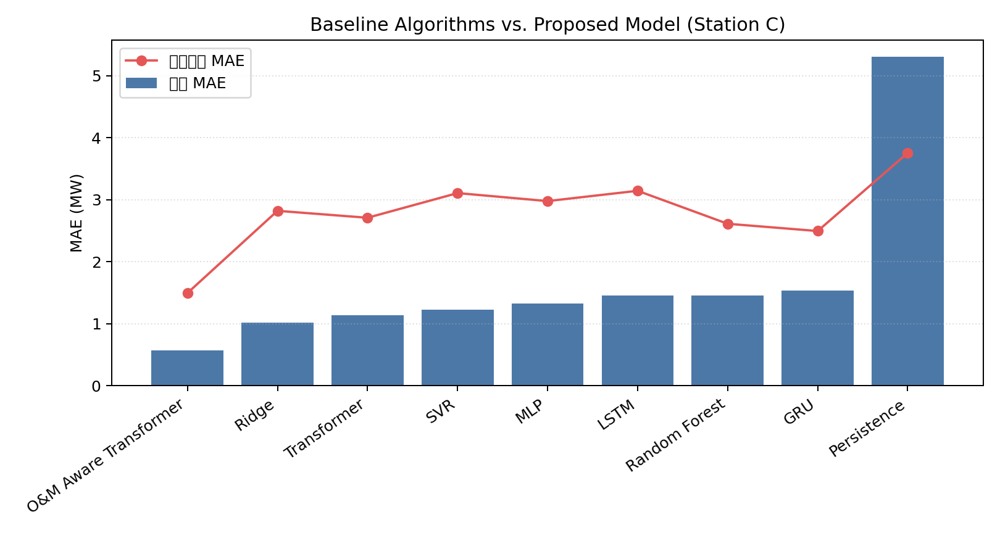

# 电站功率时序预测实验结果分析报告

本报告汇总了融合场站异构性与运维事件感知的 Transformer 光伏电站短期功率预测实验数据，用于支撑期刊/会议论文的实验与分析章节。数据协议、时间切分与事件分布见《实验协议与数据统计补充.md》。

## 1. 实验一：场站特异性专属建模 vs. 空间共享多站模型
该实验对比了为各电站单独训练的专属模型（场站特异性专属建模）与多站数据合并后训练的通用模型之间的误差指标。结果用于评估多场站混合训练在容量和气象模式存在差异时可能带来的负迁移风险。

| 评估场站   | 场站特异性专属模型 MAE   | 空间共享多站模型 MAE   | 场站特异性专属模型 RMSE   | 空间共享多站模型 RMSE   | 性能提升率 (MAE)   |
|:-------|:----------------|:---------------|:-----------------|:----------------|:--------------|
| 场站 A   | 1.955 MW        | 6.128 MW       | 7.187 MW         | 9.238 MW        | 68.10%        |
| 场站 B   | 1.812 MW        | 2.947 MW       | 4.220 MW         | 5.253 MW        | 38.52%        |
| 场站 C   | 0.605 MW        | 0.769 MW       | 1.509 MW         | 1.734 MW        | 21.34%        |

## 2. 实验二：融入运维数据前后对比
在故障和检修频发且老化的场站 C 上进行对比实验，分别验证基线 Transformer（不融合任何运维状态数据）与本章所提运维感知模型的表现：

| 评估时段             | 基线 Transformer (未融合) MAE   | 运维感知 Transformer (融合) MAE   | 误差降幅   |
|:-----------------|:---------------------------|:----------------------------|:-------|
| 总体时段 (Overall)   | 1.508 MW                   | 0.605 MW                    | 59.89% |
| 常规无事件时段 (Normal) | 1.433 MW                   | 0.457 MW                    | 68.08% |
| 运维事件时段 (Events)  | 1.935 MW                   | 1.443 MW                    | 25.42% |

> **分析**：引入运维事件特征后，模型在总体时段和运维事件切片上均有误差下降，说明事件状态对异常片段预测具有补充信息价值。具体降幅以表中自动生成数值为准。

## 3. 实验三：消融实验与 O&M Gate 门控效果验证
普通的深度学习模型即使输入了“检修”特征，也可能因为检修样本稀疏而在预测时保留功率输出残留。本章所提模型引入可微运维门控（O&M Gate），在计划检修已知时对输出施加抑制偏置：

| 指标评估                     | 基线 Transformer (不含事件)   | 常规特征融合模型 (无门控)   | 运维感知 Transformer (含门控)   | 门控置零提升幅度   |
|:-------------------------|:------------------------|:-----------------|:-------------------------|:-----------|
| 计划检修时段 (Maintenance) MAE | 5.735 MW                | 0.115 MW         | 0.104 MW                 | 9.05%      |

### 典型检修时段预测曲线拟合度对比：

> **分析**：从拟合图可以看出，基线模型在检修期间存在明显预测残留；未加门控的普通融合模型预测值有所下降；O&M Gate 在端到端训练框架内进一步降低了检修片段残留。工程规则后处理仍应作为上限基线单独报告。

## 4. 实验四：门控先验偏置 $\beta_1$ 的灵敏度与收敛性分析
探究可微门控中检修状态先验偏置 $\beta_1$ 设定对输出置零效果的影响。实验在场站 C 上进行测试：

|   门控先验偏置 beta_1 | 计划检修期 MAE   | 物理收敛状态评估      |
|----------------:|:------------|:--------------|
|               0 | 0.1418 MW   | 较强抑制 (存在微量残留) |
|               1 | 0.1091 MW   | 高抑制区 (残留较小)   |
|               5 | 0.1036 MW   | 高抑制区 (残留较小)   |
|              10 | 0.1057 MW   | 高抑制区 (残留较小)   |
|              15 | 0.1103 MW   | 高抑制区 (残留较小)   |

> **分析**：随着 $\beta_1$ 增加，检修期输出抑制增强并逐步进入饱和区。过小偏置可能保留预测残留，过大偏置可能削弱门控分支梯度，因此本文将 $\beta_1=10.0$ 作为折中设置，并将规则后处理作为工程上限对照。

## 5. 实验五：不同预测时间跨度 $H$ 敏感性分析
测试所提模型在不同超前预测跨度 $H$ 下的泛化能力和预测误差，测试范围为 12~72 小时：

| 超前预测窗口 H   | 测试集 MAE   | 测试集 RMSE   |
|:-----------|:----------|:-----------|
| 12 小时      | 0.802 MW  | 1.637 MW   |
| 24 小时      | 0.498 MW  | 1.421 MW   |
| 48 小时      | 0.558 MW  | 1.364 MW   |
| 72 小时      | 0.550 MW  | 1.396 MW   |

> **分析**：随着超前预测步长增加，预测难度随之加大，MAE 与 RMSE 指标通常会上升。该实验用于说明模型对不同预测跨度的敏感性，而非单独证明泛化能力。

## 补充实验：经典算法对比实验

在场站 C 上补充传统统计/机器学习/深度学习模型对比，用于验证本文方法相较经典算法的适配优势。

| 模型                    |   总体 MAE (MW) |   总体 RMSE (MW) |   事件时段 MAE (MW) |
|:----------------------|--------------:|---------------:|----------------:|
| O&M Aware Transformer |         0.569 |          1.503 |           1.495 |
| Ridge                 |         1.017 |          2.205 |           2.821 |
| Transformer           |         1.135 |          2.44  |           2.709 |
| SVR                   |         1.224 |          2.379 |           3.107 |
| MLP                   |         1.321 |          2.442 |           2.978 |
| LSTM                  |         1.453 |          2.546 |           3.144 |
| Random Forest         |         1.453 |          2.65  |           2.612 |
| GRU                   |         1.536 |          2.564 |           2.495 |
| Persistence           |         5.309 |          7.669 |           3.754 |

> **分析**：本文方法在总体 MAE 和事件时段 MAE 上均优于多数经典基线。普通 Transformer 仍高于本文方法，说明运维事件嵌入和门控输出抑制对异常运维场景具有补充价值。
