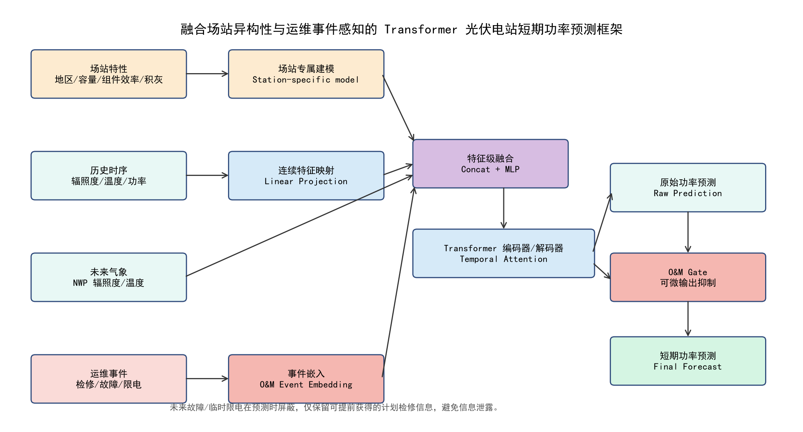

# 方法论与模型设计

## 2 多源数据定义与预处理

### 2.1 特征维度与多源输入定义

对于待预测的目标场站，设滑动窗口时间步长为 $T_{hist}$，超前预测跨度为 $H$ 步。输入特征由连续与离散四路异构张量组成：

1. 历史气象与出力连续时序向量 $\mathbf{X}_{hist} \in \mathbb{R}^{T_{hist} \times 3}$，包含辐照度、温度及实际有功功率。

2. 历史离散运维事件符号序列 $\mathbf{E}_{hist} \in \mathbb{Z}^{T_{hist}}$，由 SCADA 系统生成的异常代码。

3. 未来连续气象预报向量 $\mathbf{X}_{fut} \in \mathbb{R}^{H \times 2}$，由 NWP 提供。

4. 未来已知确定性运维计划序列 $\mathbf{E}_{fut} \in \mathbb{Z}^H$，仅保留计划检修等确知指令，屏蔽未来不可知故障以防数据泄露。

### 2.2 离散运维事件字典定义

本文将复杂工单日志精简为四类核心映射规则：0（Normal，正常）、1（Scheduled Maintenance，计划检修停机）、2（Device Fault，设备突发故障降容）以及 3（Grid Curtailment，电网调度限电）。这些符号构成了非欧几里得的离散特征全集。

### 2.3 数据清洗与标准化处理

对于连续特征，进行标准差归一化 $\frac{x-\mu}{\sigma}$ 处理；对于离群野值，采用滑动窗口中值滤波插值。特别地，标准化后的功率可能为负数，因此要求模型的输出预测头不可采用 ReLU 截断激活函数，而必须保留线性算子以维持夜间弱光工况下的梯度传播。

### 2.4 研究区域与气象环境特征剖析

本研究所选取的三个光伏场站具有不同的地理区位与气候特征：

1. **吉林地区风光互补场站（场站A）**：该场站地处高纬度干旱区域，边缘属温带大陆性荒漠气候。全年日照时数长，大气透明度高。其气象特征是晴天辐照度曲线平滑且峰值高。该场站装机规模为 100MW，设备处于较好的运行状态。模型在此场景下主要检验其对长周期季节变化的适应能力与理论拟合上限。

2. **济宁地区平原光伏电站（场站B）**：位于黄淮海平原腹地，受季风气候影响显著。夏季高温多雨，冬季易受云雾天气遮挡。由于平原地区空气对流及气溶胶遮蔽，地表短波辐射常在云团运动下产生震荡，导致出力曲线呈现高频波动。该场站装机规模为 50MW，主要用于检验预测模型对变率较大的气象输入的抗干扰性能与鲁棒性。

3. **云南地区山地光伏电站（场站C）**：地处低纬度高海拔山地地带，海拔差异显著。受地形和高原季风气候影响，局部天气变化迅速，且存在山体及组件阴影遮挡。该电站装机规模为 20MW，投运时间超 8 年，设备故障率高于其他场站，且常接收到省调限电指令。因此，场站 C 是验证本文所提运维事件感知与物理约束能力的核心场景。

## 3 运维感知 Transformer 功率预测模型设计

为对应前文提出的场站异构性、运维事件缺失和模型结构适配三类问题，本文模型整体采用“场站专属建模、事件嵌入融合、Transformer 时序建模与 O&M Gate 输出抑制”的组合结构。图 1 展示了模型的整体流程：场站特性用于确定本地化建模边界；历史功率、辐照度和温度作为连续时序输入；计划检修、设备故障和限电等运维事件经嵌入层转换为连续向量；融合后的多源特征进入 Transformer 编解码器；最终通过 O&M Gate 对计划检修等确定性事件下的输出进行抑制。

  
  
<b>图 1 融合场站异构性与运维事件感知的 Transformer 模型结构图</b>

### 3.1 离散运维事件嵌入与特征级联

为了实现离散运维符号与连续时序向量的统一建模，本文采用可学习事件嵌入层。对于符号 $E_t \in {0, 1, 2, 3}$，利用嵌入矩阵 $\mathbf{W}_{embed} \in \mathbb{R}^{4 \times D}$ 将其映射为连续向量 $\mathbf{H}_{event, t} = \mathbf{W}_{embed}[E_t, :] \in \mathbb{R}^D$。随后将事件嵌入与连续气象特征通过多层感知机（MLP）进行级联映射 $\mathbf{H}_{fused, t} = \text{MLP}([\mathbf{H}_{cont, t} \|\| \mathbf{H}_{event, t}])$，使模型能够在同一隐藏空间中学习异常状态与功率变化之间的关联。

### 3.2 自注意力机制与时序 Transformer 编解码

融合特征序列经过正弦位置编码后送入多头自注意力（Self-Attention）编码器中。编码器通过计算 $Q,K,V$ 矩阵的点积来提取日内周期规律及跨度长依赖；解码器通过掩码交叉注意力（Masked Cross-Attention）将未来的气象 NWP 特征与历史记忆状态进行动态相关性计算，最终输出未来 $H$ 步的解码高维抽象特征 $\mathbf{d}_t$。

### 3.3 物理先验端到端门控约束网络 (O&M Gate)

在解码预测头部分，针对计划检修停机时实际出力接近 0 的工程约束，本文设计双路并行门控分支。第一路通过线性层生成基准预测功率 $\hat{P}_{raw, t}$；第二路通过门控分支计算削减比率 $g_t \in [0, 1]$，其在 Sigmoid 函数内部引入事件偏置向量 $\beta_{E'_t}$：

$$g_t = \sigma( \mathbf{W}_g \mathbf{d}_t + \beta_{E'_t} )$$

最终受物理先验约束的输出为 $\hat{P}_{final, t} = \hat{P}_{raw, t} \cdot (1 - g_t)$。

**可微性与收敛分析**：当计划检修事件发生时，通过设置较大的先验偏置 $\beta_1 = 10.0$ 使 $g_t$ 接近 1.0，从而抑制预测输出。根据微分链式法则，损失对隐状态的偏导数为：

$$\frac{\partial \hat{P}_{final, t}}{\partial \mathbf{d}_t} = (1 - g_t) \mathbf{W}_p^T - \hat{P}_{raw, t} g_t (1 - g_t) \mathbf{W}_g^T$$

即使在第一项梯度趋近于 0 的情况下，只要原始理论预测 $\hat{P}_{raw, t} \neq 0$，第二项交叉导数在偏置有限的情况下仍可传导微小梯度。相比于硬性后处理规则，该机制有助于保持计算图的连通，为端到端协同优化提供了可能。

### 3.4 经典 Transformer 数学形式化表达

在特征输入端，对于长度为 $T_{hist}$ 的多源融合特征矩阵 $\mathbf{H}_{fused} \in \mathbb{R}^{T_{hist} \times D}$，为打破序列数据的置换不变性，引入了基于三角函数的绝对位置编码（Positional Encoding）：

$$PE_{(pos, 2i)} = \sin(pos / 10000^{2i/D}), \quad PE_{(pos, 2i+1)} = \cos(pos / 10000^{2i/D})$$

将位置编码与输入矩阵逐元素相加后，输入至多头自注意力层（Multi-Head Self-Attention）。对于第 $h$ 个注意力头，其查询、键、值矩阵分别由独立的参数矩阵映射生成：

$$\mathbf{Q}_h = \mathbf{H}_{in} \mathbf{W}_h^Q, \quad \mathbf{K}_h = \mathbf{H}_{in} \mathbf{W}_h^K, \quad \mathbf{V}_h = \mathbf{H}_{in} \mathbf{W}_h^V$$

注意力得分矩阵通过缩放点积（Scaled Dot-Product）计算，并通过 Softmax 函数转化为概率分布：

$$\text{Attention}(\mathbf{Q}_h, \mathbf{K}_h, \mathbf{V}_h) = \text{Softmax}\left(\frac{\mathbf{Q}_h \mathbf{K}_h^T}{\sqrt{d_k}}\right) \mathbf{V}_h$$

其中，$\sqrt{d_k}$ 为缩放因子，用于防止点积结果过大导致 Softmax 梯度弥散。随后，所有注意力头的输出在特征维度上进行拼接，并通过前馈神经网络（FFN）进行非线性维度变换：

$$\text{FFN}(\mathbf{x}) = \text{ReLU}(\mathbf{x} \mathbf{W}_1 + \mathbf{b}_1) \mathbf{W}_2 + \mathbf{b}_2$$

配合残差连接（Residual Connection）和层归一化（Layer Normalization），可缓解深层网络的梯度消失问题，形成完整的时序依赖建模能力。

### 3.5 雅可比矩阵与全链路梯度流经验分析 (Jacobian and Gradient Flow Empirical Analysis)

在本文设计的物理先验门控网络（O&M Gate）中，梯度能否有效回传影响着模型底层的参数优化。设门控算子输出为 $\hat{P}_{final} = \hat{P}_{raw} \cdot (1 - g)$，其中 $g = \sigma(\mathbf{W}_g \mathbf{d} + \beta)$。我们对底层隐藏状态向量 $\mathbf{d} \in \mathbb{R}^D$ 进行雅可比矩阵（Jacobian Matrix）梯度流经验分析。

定义均方误差损失项 $L = \frac{1}{2} (\hat{P}_{final} - P_{true})^2$，其关于状态向量 $\mathbf{d}$ 的梯度计算展开为：

$$\frac{\partial L}{\partial \mathbf{d}} = \frac{\partial L}{\partial \hat{P}_{final}} \left( \frac{\partial \hat{P}_{final}}{\partial \hat{P}_{raw}} \frac{\partial \hat{P}_{raw}}{\partial \mathbf{d}} + \frac{\partial \hat{P}_{final}}{\partial g} \frac{\partial g}{\partial \mathbf{d}} \right)$$

代入偏导数项：$\frac{\partial \hat{P}_{final}}{\partial \hat{P}_{raw}} = 1 - g, \quad \frac{\partial \hat{P}_{raw}}{\partial \mathbf{d}} = \mathbf{W}_p^T, \quad \frac{\partial \hat{P}_{final}}{\partial g} = -\hat{P}_{raw}$，以及 Sigmoid 门控偏导数 $\frac{\partial g}{\partial \mathbf{d}} = g(1 - g) \mathbf{W}_g^T$，得到全链路梯度展开式：

$$\mathbf{J}_{\mathbf{d}} = (\hat{P}_{final} - P_{true}) \left[ (1 - g) \mathbf{W}_p^T - \hat{P}_{raw} g(1 - g) \mathbf{W}_g^T \right]$$

**梯度流经验分析**：当系统处于计划检修状态时，若设置极大的理论偏置 $\beta \to \infty$，则门控削减比率 $g \to 1.0$，此时导数项 $g(1-g) \to 0$，可能导致梯度衰减。然而在实验中将偏置设为有限常数（例如 $\beta = 10.0$），削减比率处于高饱和区间但未达到数学意义上的绝对 1.0。因而，交叉乘积项 $g(1-g)$ 虽小但仍为非零数。只要原始预测输出 $\hat{P}_{raw} \neq 0$，该分支仍保留一定梯度通路。该设计不能替代严格的电气约束求解，但可作为神经预测模型中的可微输出抑制机制。

### 3.6 前向与反向传播算法伪代码

为了便于工程复现，将上述过程抽象为如下算法逻辑：

**算法 1：运维事件感知 Transformer 的端到端训练算法**

**输入**：历史气象与功率 $\mathbf{X}_{hist}$，离散事件 $\mathbf{E}_{hist}$，未来气象预报 $\mathbf{X}_{fut}$，已知检修指令 $\mathbf{E}_{fut}$。

**输出**：网络权重 $\Theta$ 与未来 $H$ 步预测功率 $\hat{\mathbf{P}}_{final}$。

1. 初始化网络参数 $\Theta$，门控层偏置 $\beta_{E'_t}$ 根据物理先验初始化。

2. **FOR** $epoch = 1, 2, ..., N_{epochs}$ **DO**:

3. 提取当前 Batch 数据。

4. 事件嵌入：利用 $\mathbf{W}_{embed}$ 将 $\mathbf{E}_{hist}$ 映射为连续向量 $\mathbf{H}_{event}$。

5. 特征级联：$\mathbf{H}_{fused} = \text{MLP}([\mathbf{X}_{hist} \|\| \mathbf{H}_{event}])$。

6. 编码过程：$\mathbf{C} = \text{Encoder}(\mathbf{H}_{fused} + \text{PE})$。

7. 解码过程：$\mathbf{d}_t = \text{Decoder}(\mathbf{C}, \mathbf{X}_{fut} + \text{PE})$。

8. O&M 门控约束计算：

      $\hat{P}_{raw, t} = \mathbf{W}_p \mathbf{d}_t + b_p$

      $g_t = \text{Sigmoid}(\mathbf{W}_g \mathbf{d}_t + \beta_{E'_t})$

      $\hat{P}_{final, t} = \hat{P}_{raw, t} \cdot (1 - g_t)$

9. 计算损失函数：$L = \text{MSE}(\hat{\mathbf{P}}_{final}, \mathbf{P}_{true})$。

10.反向传播：依据雅可比矩阵 $\mathbf{J}_{\mathbf{d}}$ 更新参数 $\Theta \leftarrow \text{AdamW}(L, \Theta)$。

11.**END FOR**
